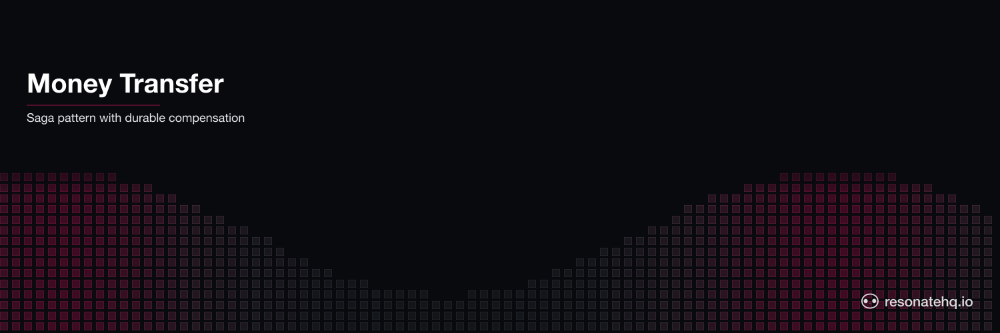

<p align="center">
  <picture>
    <source media="(prefers-color-scheme: dark)" srcset="./assets/banner-dark.png">
    <source media="(prefers-color-scheme: light)" srcset="./assets/banner-light.png">
    
  </picture>
</p>

<p align="center">
  <a href="https://resonatehq.github.io/examples-ci/">
    
  </a>
</p>

# Money Transfer | Resonate Go SDK

A workflow that moves money between two accounts as a saga — withdraw from the source, deposit to the target, and on a deposit-side failure run a compensating refund. Each step is durable and idempotent, so a worker crash mid-transfer never leaves the ledger in a half-applied state.

> Heads up — `resonate-sdk-go` is pre-release. The SDK has no semver tag yet, so this example pins to a specific commit. Expect API changes until `v0.1.0`.

## What this demonstrates

- The **saga pattern**: a multi-step operation written as straight-line Go, with compensation triggered when a step fails.
- **Durable steps.** Each `ctx.Run(...)` call is a checkpoint. If the worker crashes after the withdraw but before the deposit, Resonate replays from the last settled step rather than starting over.
- **Inline compensation.** When the deposit step fails, the error branch runs the inverse of whatever has already settled — here, a refund to the source — instead of unwinding a separate compensation stack.
- **Idempotency.** Ledger entries are keyed by a deterministic operation id (`<id>-withdraw`, `<id>-deposit`, `<id>-refund`), so a replay applies each entry once and only once.
- Running against **localnet** (no external server) for quick exploration, or a real **Resonate dev server** for crash recovery.

## The code

```go
func transferMoney(ctx *resonate.Context, args TransferArgs) (TransferResult, error) {
    logf("\n[saga] transfer %s: %s -> %s  $%.2f\n",
        args.TransferID, args.Source, args.Target, args.Amount)

    withdrawID := args.TransferID + "-withdraw"
    depositID  := args.TransferID + "-deposit"
    refundID   := args.TransferID + "-refund"

    // Step 1 — withdraw from the source.
    f1, err := ctx.Run(withdraw, AccountOp{OpID: withdrawID, Account: args.Source, Amount: args.Amount})
    if err != nil {
        return TransferResult{}, fmt.Errorf("withdraw dispatch: %w", err)
    }
    var w OpResult
    if err := f1.Await(&w); err != nil {
        return TransferResult{}, fmt.Errorf("withdraw: %w", err)
    }

    // Step 2 — deposit to the target. NoRetry: the saga's compensation IS the
    // response to a deposit-side failure, so don't let backoff delay it.
    f2, err := ctx.Run(deposit,
        AccountOp{OpID: depositID, Account: args.Target, Amount: args.Amount, Fail: args.FailDeposit},
        resonate.RunOpts{RetryPolicy: resonate.NoRetry},
    )
    if err != nil {
        return TransferResult{}, fmt.Errorf("deposit dispatch: %w", err)
    }
    var d OpResult
    if err := f2.Await(&d); err != nil {
        // The deposit failed after the withdraw settled — undo it by refunding
        // the source. A longer saga undoes each completed step in reverse (LIFO).
        logf("[saga] deposit failed: %v — compensating\n", err)
        fr, cerr := ctx.Run(refund, AccountOp{OpID: refundID, Account: args.Source, Amount: args.Amount})
        if cerr == nil {
            var ref OpResult
            if err := fr.Await(&ref); err != nil {
                logf("[saga] refund failed: %v\n", err) // best-effort: the saga already failed
            }
        }
        return TransferResult{TransferID: args.TransferID, Status: "compensated", Error: err.Error()}, nil
    }

    logf("[saga] transfer %s committed\n", args.TransferID)
    return TransferResult{TransferID: args.TransferID, Status: "committed",
        Source: args.Source, Target: args.Target, Amount: args.Amount}, nil
}
```

`ctx.Run(fn, args)` runs a step as a durable child and returns a `*Future`; `f.Await(&out)` blocks until it settles and decodes the result. The step functions (`withdraw`, `deposit`, `refund`) are passed by value — they don't need to be registered. Only the top-level `transferMoney` saga is registered, because that's what gets invoked by promise ID.

The compensation lives in the error branch: when the deposit fails, the one step that completed — the withdraw — is undone by a refund. A longer saga tracks which steps settled and undoes them in reverse (LIFO) order. (`logf` is a thin `fmt.Printf` wrapper that prints the trace unless `-quiet` or benchmark mode silences it.)

> **Note on retries:** `resonate.NoRetry` on the deposit step means a failure triggers compensation immediately rather than after the SDK's default exponential backoff. In production you might allow a few retries first (network blips happen) and compensate only once the target has clearly rejected the deposit.

## Prerequisites

- Go 1.22+
- **Optional (for crash-recovery demo):** the `resonate` server CLI.
  Install with Homebrew on macOS or Linux:
  ```sh
  brew install resonatehq/tap/resonate
  ```
  Other install paths: <https://docs.resonatehq.io/get-started/quickstart>.

## Setup

```sh
git clone https://github.com/resonatehq-examples/example-money-transfer-go.git
cd example-money-transfer-go
go mod download
```

## Run it

### Localnet mode (no server required)

```sh
go run .
```

The binary builds an in-process Resonate instance using `localnet` — no external process needed. It seeds `alice` with $200, transfers $50 to `bob`, and prints the committed result.

Force the deposit to fail so the saga compensates — use a fresh `-id` so it isn't served the committed result cached under the happy-path ID:

```sh
go run . -fail -id=money-transfer-2
```

You'll see the withdraw settle, the deposit fail, and a compensating refund restore the source balance.

> **Localnet limitation:** the server state lives in process memory. A process crash also destroys the ledger and promise state, so the crash-recovery story is not demonstrable in this mode. Use real-server mode below for that.

### Benchmark mode (-n)

Run N sequential transfers and get a count/elapsed/tps summary — useful for throughput benchmarks:

```sh
go run . -n=100 -id=bench
```

Output is suppressed automatically in batch mode so only the summary prints:

```
[bench] running 100 sequential transfers (id prefix=bench amount=50.00 fail=false)
[bench] done  n=100 committed=100 compensated=0 elapsed=42ms tps=2381.0
```

Mix in compensations to measure the failure path:

```sh
go run . -n=50 -id=bench-fail -fail
```

You can also add `-quiet` to a single-transfer run to suppress ledger output.

### Real-server mode (crash recovery)

In one terminal, start the dev server:

```sh
resonate dev
```

In another, run the example pointing at the server:

```sh
go run . -url=http://localhost:8001
```

The binary defaults to promise ID `money-transfer-1`. Re-running with the same ID re-attaches to the existing workflow rather than starting a new one — Resonate deduplicates on the ID. Use a fresh `-id` (and `-fail`) to drive the compensation path against the same server:

```sh
go run . -url=http://localhost:8001 -fail -id=money-transfer-2
```

## What to look for

**Happy path (default):**

```
  [ledger] seed-alice: alice +200.00  // seed
opening balances: alice=200.00 bob=0.00
[main] using localnet (in-process, no external server required)
[main] note: localnet state is ephemeral — crash recovery requires -url=<server>
[main] invoking saga id=money-transfer-1 fail=false

[saga] transfer money-transfer-1: alice -> bob  $50.00
  [ledger] money-transfer-1-withdraw: alice -50.00  // withdraw
  [ledger] money-transfer-1-deposit: bob +50.00  // deposit
[saga] transfer money-transfer-1 committed
[main] result: {TransferID:money-transfer-1 Status:committed Source:alice Target:bob Amount:50 Error:}
closing balances: alice=150.00 bob=50.00
```

**Compensation path (`-fail`):**

```
  [ledger] seed-alice: alice +200.00  // seed
opening balances: alice=200.00 bob=0.00
[main] using localnet (in-process, no external server required)
[main] note: localnet state is ephemeral — crash recovery requires -url=<server>
[main] invoking saga id=money-transfer-2 fail=true

[saga] transfer money-transfer-2: alice -> bob  $50.00
  [ledger] money-transfer-2-withdraw: alice -50.00  // withdraw
[saga] deposit failed: application error: account bob rejected the deposit — compensating
  [ledger] money-transfer-2-refund: alice +50.00  // refund
[main] result: {TransferID:money-transfer-2 Status:compensated Source: Target: Amount:0 Error:application error: account bob rejected the deposit}
closing balances: alice=200.00 bob=0.00
```

The deposit never applies, the withdraw is reversed by the refund, and `alice` ends at her opening balance — the saga aborted cleanly. Each ledger entry is keyed by its operation id, so if the workflow replays after a crash, an already-applied entry is an idempotent no-op (`... already applied`) rather than a double charge.

## File structure

```
example-money-transfer-go/
├── main.go        ledger, step functions, the saga, and entry point
├── go.mod         module declaration + SDK pin
├── go.sum         checksums
├── assets/        README banner images
├── LICENSE        Apache-2.0
└── README.md
```

## Next steps

- **Coming from Temporal?** See [MIGRATING-FROM-TEMPORAL.md](MIGRATING-FROM-TEMPORAL.md) — a side-by-side port of the matching `temporalio/samples-go` example.
- [Get started](https://docs.resonatehq.io/get-started) — install paths + first-program walkthrough.
- [Durable execution concepts](https://docs.resonatehq.io/learn/durable-execution) — what makes invocations durable and how the runtime resumes them.
- [`example-durable-sleep-go`](https://github.com/resonatehq-examples/example-durable-sleep-go) — durable timers that survive worker restarts.
- [`example-human-in-the-loop-go`](https://github.com/resonatehq-examples/example-human-in-the-loop-go) — pause a workflow on an external decision via a latent promise.

## Community

- Discord: <https://resonatehq.io/discord>
- X: <https://x.com/resonatehqio>
- LinkedIn: <https://linkedin.com/company/resonatehq>
- YouTube: <https://youtube.com/@resonatehq>
- Journal: <https://journal.resonatehq.io>

## License

[Apache-2.0](./LICENSE)
